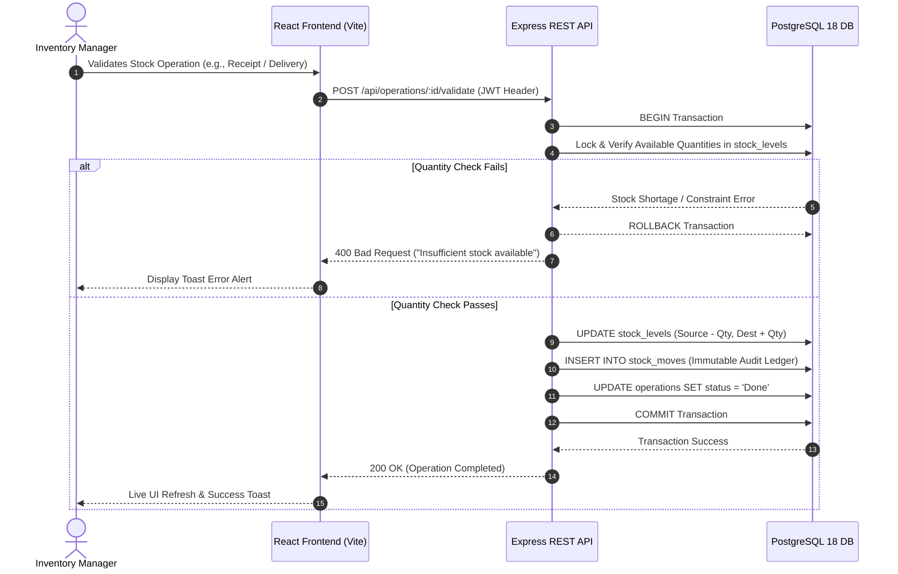
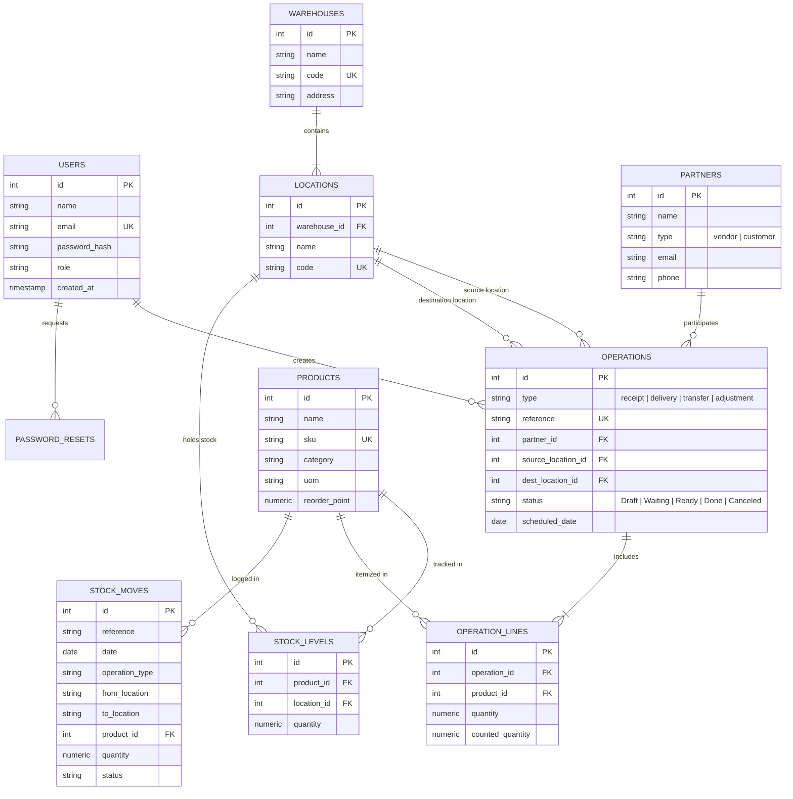

# 📦 StockSense - Modular Enterprise Inventory Management System (IMS)

[](https://nodejs.org/)
[](https://expressjs.com/)
[](https://reactjs.org/)
[](https://vitejs.dev/)
[](https://www.postgresql.org/)

**StockSense** is an enterprise-grade, double-entry inventory management system designed to digitize and automate warehouse operations, stock movement tracking, reorder point alerting, and physical inventory auditing. Built with a production-ready **React + Vite** frontend, a high-throughput **Node.js / Express** REST API, and a robust **PostgreSQL 18** database with strict ACID transaction guarantees.

---

## 📐 System Architecture Diagram

```
                              ┌──────────────────────────────────────────────┐
                              │             USER WEB BROWSER                 │
                              │     (React 18 + Vite SPA @ Port 3000)        │
                              └──────────────────────┬───────────────────────┘
                                                     │
                                                     │ HTTP REST API / JSON
                                                     │ (JWT Auth Headers)
                                                     ▼
                              ┌──────────────────────────────────────────────┐
                              │             EXPRESS.JS BACKEND               │
                              │           (Node.js @ Port 5000)              │
                              ├──────────────────────────────────────────────┤
                              │  ├── Middleware (Auth JWT, Error Handler)    │
                              │  ├── Controllers (Auth, Products, Ops, etc.) │
                              │  └── Config (pg Pool Connection Manager)     │
                              └──────────────────────┬───────────────────────┘
                                                     │
                                                     │ Native SQL Queries
                                                     │ ACID Transactions (BEGIN/COMMIT)
                                                     ▼
                              ┌──────────────────────────────────────────────┐
                              │           POSTGRESQL 18 DATABASE             │
                              │       (localhost:5432/stocksense_db)         │
                              ├──────────────────────────────────────────────┤
                              │  ├── Users & Password Resets                 │
                              │  ├── Warehouses & Internal Locations         │
                              │  ├── Products & Live Stock Levels            │
                              │  ├── Stock Operations & Operation Lines      │
                              │  └── Immutable Stock Movement Ledger         │
                              └──────────────────────────────────────────────┘
```

### 🔀 System Interaction Flow (Mermaid Sequence)



---

## 🗄️ Database Entity-Relationship (ER) Diagram



---

## ✨ Key Features & Highlights

1. **Double-Entry Stock Ledger**:
   - Every physical stock movement (Receipts, Deliveries, Internal Transfers, Inventory Adjustments) requires explicit source and destination locations.
   - Validating an operation automatically updates location stock balances and appends an entry to the immutable `stock_moves` ledger.

2. **Real Local Database Integration**:
   - Direct connection to PostgreSQL on `localhost:5432/stocksense_db`.
   - Native node-postgres (`pg`) connection pooling with SQL transactions (`BEGIN`, `COMMIT`, `ROLLBACK`) ensuring zero negative stock balances and data integrity.

3. **Dynamic Live Data**:
   - Zero static JSON mock files. All metrics, low-stock warnings, SKU movements, and warehouse locations are dynamically aggregated via live SQL queries.

4. **OTP Password Reset & Authentication Flow**:
   - Secure password reset flow using 6-digit OTP codes stored in PostgreSQL with expiration verification.
   - JWT-based authorization header management.

5. **Enterprise UI/UX Design**:
   - Custom Glassmorphism interface with dark/light mode toggle.
   - Full support for custom login/signup graphic background image integration.
   - Instant visual feedback via toast notifications and detailed operation status badges (`Draft`, `Waiting`, `Ready`, `Done`, `Canceled`).

---

## 🔌 API Endpoint Reference

| Category | Endpoint | Method | Auth | Description |
| :--- | :--- | :---: | :---: | :--- |
| **Auth** | `/api/auth/login` | `POST` | ❌ | Authenticate user & receive JWT token |
| **Auth** | `/api/auth/signup` | `POST` | ❌ | Register new user account |
| **Auth** | `/api/auth/forgot-password` | `POST` | ❌ | Request 6-digit OTP code for password reset |
| **Auth** | `/api/auth/reset-password` | `POST` | ❌ | Verify OTP & update password |
| **Dashboard**| `/api/dashboard/stats` | `GET` | 🔒 | Get live summary metrics, low-stock alerts, & recent moves |
| **Products** | `/api/products` | `GET` | 🔒 | List all products with current stock breakdown |
| **Products** | `/api/products` | `POST` | 🔒 | Create new product SKU with initial stock allocation |
| **Products** | `/api/products/:id` | `PUT` | 🔒 | Update product details & reorder thresholds |
| **Operations**| `/api/operations` | `GET` | 🔒 | Filter operations by type (`receipt`, `delivery`, `transfer`, `adjustment`) |
| **Operations**| `/api/operations` | `POST` | 🔒 | Create a new operation draft |
| **Operations**| `/api/operations/:id` | `GET` | 🔒 | Get detailed operation sheet with item lines |
| **Operations**| `/api/operations/:id/validate` | `POST` | 🔒 | Execute transaction: commit stock updates & write to ledger |
| **Partners** | `/api/partners` | `GET` | 🔒 | Fetch vendor and customer directory |
| **Warehouses**| `/api/warehouses` | `GET` | 🔒 | Fetch warehouses and internal locations |
| **Ledger** | `/api/move-history` | `GET` | 🔒 | Query immutable stock movement audit logs |

---

## 🛠️ Tech Stack & Dependencies

### Frontend (`/frontend`)
- **Core**: React 18, Vite 6
- **Icons**: `lucide-react`
- **Styling**: Vanilla CSS3 (CSS Variables, Glassmorphism, Responsive Grid)
- **HTTP Client**: Native `fetch` with centralized API wrapper

### Backend (`/backend`)
- **Runtime**: Node.js v18+
- **Framework**: Express.js
- **Database Driver**: `pg` (Native PostgreSQL client with connection pooling)
- **Security**: `bcryptjs` (Password hashing), `jsonwebtoken` (JWT authentication)
- **Utilities**: `cors`, `dotenv`

### Database
- **Engine**: PostgreSQL 18
- **ORM / Query Builder**: Raw SQL queries for maximum execution speed and predictability

---

## 📁 Repository Directory Structure

```
sense-stock/
├── backend/
│   ├── src/
│   │   ├── config/
│   │   │   └── db.js            # PostgreSQL connection pool configuration
│   │   ├── controllers/         # Request handling & transaction logic
│   │   │   ├── authController.js
│   │   │   ├── dashboardController.js
│   │   │   ├── moveHistoryController.js
│   │   │   ├── operationController.js
│   │   │   ├── partnerController.js
│   │   │   ├── productController.js
│   │   │   └── warehouseController.js
│   │   ├── db/                  # Schema & Database seed migrations
│   │   │   ├── migrate.js       # Automated table setup & initial data seed
│   │   │   └── schema.sql       # PostgreSQL table schemas & foreign keys
│   │   ├── middleware/          # JWT authorization & centralized error handling
│   │   │   └── auth.js
│   │   ├── routes/              # Express API route declarations
│   │   │   ├── authRoutes.js
│   │   │   ├── dashboardRoutes.js
│   │   │   ├── moveHistoryRoutes.js
│   │   │   ├── operationRoutes.js
│   │   │   ├── partnerRoutes.js
│   │   │   ├── productRoutes.js
│   │   │   └── warehouseRoutes.js
│   │   ├── app.js               # Express application initialization
│   │   └── server.js            # Server entry point
│   ├── .env.example
│   └── package.json
│
├── frontend/
│   ├── public/
│   │   └── auth-bg.png          # Static custom login/signup background asset
│   ├── src/
│   │   ├── api/
│   │   │   └── client.js        # REST API HTTP client
│   │   ├── assets/
│   │   │   └── auth-bg.png      # Login background graphic
│   │   ├── components/          # Reusable UI elements (Navbar, Toast, Modals)
│   │   ├── context/             # React AuthContext state provider
│   │   ├── pages/               # Application page views
│   │   │   ├── AuthPage.jsx     # Login, Signup, OTP Reset Page
│   │   │   ├── DashboardPage.jsx
│   │   │   ├── MoveHistoryPage.jsx
│   │   │   ├── OperationDetailPage.jsx
│   │   │   ├── OperationsListPage.jsx
│   │   │   ├── ProductsPage.jsx
│   │   │   ├── ProfilePage.jsx
│   │   │   └── SettingsPage.jsx
│   │   ├── App.jsx              # Main App root with theme state
│   │   ├── index.css            # Global design tokens & CSS system
│   │   └── main.jsx
│   ├── index.html
│   └── vite.config.js
│
└── README.md
```

---

## 🚀 Getting Started

### 1. Prerequisites
Ensure you have the following installed on your machine:
- **Node.js** (v18.0.0 or higher)
- **npm** (v9.0.0 or higher)
- **PostgreSQL 14+** running locally on port `5432`

---

### 2. Database Configuration
1. Open PostgreSQL (via `psql` or **pgAdmin 4**).
2. Create the target database:
   ```sql
   CREATE DATABASE stocksense_db;
   ```

---

### 3. Backend Setup
1. Navigate to the backend folder:
   ```bash
   cd backend
   ```
2. Install dependencies:
   ```bash
   npm install
   ```
3. Create a `.env` file in `backend/.env` with your PostgreSQL credentials:
   ```env
   PORT=5000
   DB_HOST=localhost
   DB_PORT=5432
   DB_USER=postgres
   DB_PASSWORD=your_postgres_password
   DB_NAME=stocksense_db
   JWT_SECRET=super_secret_jwt_key_stocksense_2026
   ```
4. Run database migrations to populate tables and initial seed data:
   ```bash
   npm run migrate
   ```
5. Start the backend server:
   ```bash
   npm start
   ```
   *Backend server will start on `http://localhost:5000`.*

---

### 4. Frontend Setup
1. Open a new terminal tab and navigate to the frontend folder:
   ```bash
   cd frontend
   ```
2. Install dependencies:
   ```bash
   npm install
   ```
3. Start the Vite development server:
   ```bash
   npm run dev
   ```
   *Frontend application will open on `http://localhost:3000`.*

---

## 🔑 Demo Credentials

For testing and demonstration, use the following pre-seeded user credentials:

| Attribute | Value |
| :--- | :--- |
| **Email** | `demo@stocksense.app` |
| **Password** | `password123` |
| **Role** | `Inventory Manager` |

---

## 🧪 Build & Verification

To verify frontend compilation for production deployment:
```bash
cd frontend
npm run build
```

---

## 📄 License
This project is licensed under the **MIT License**.
